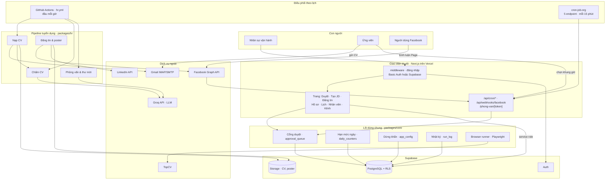
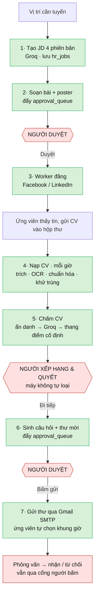
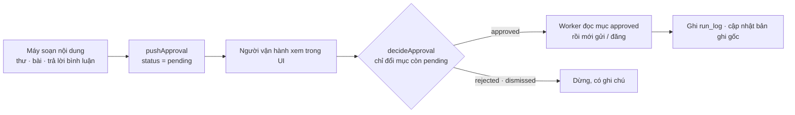
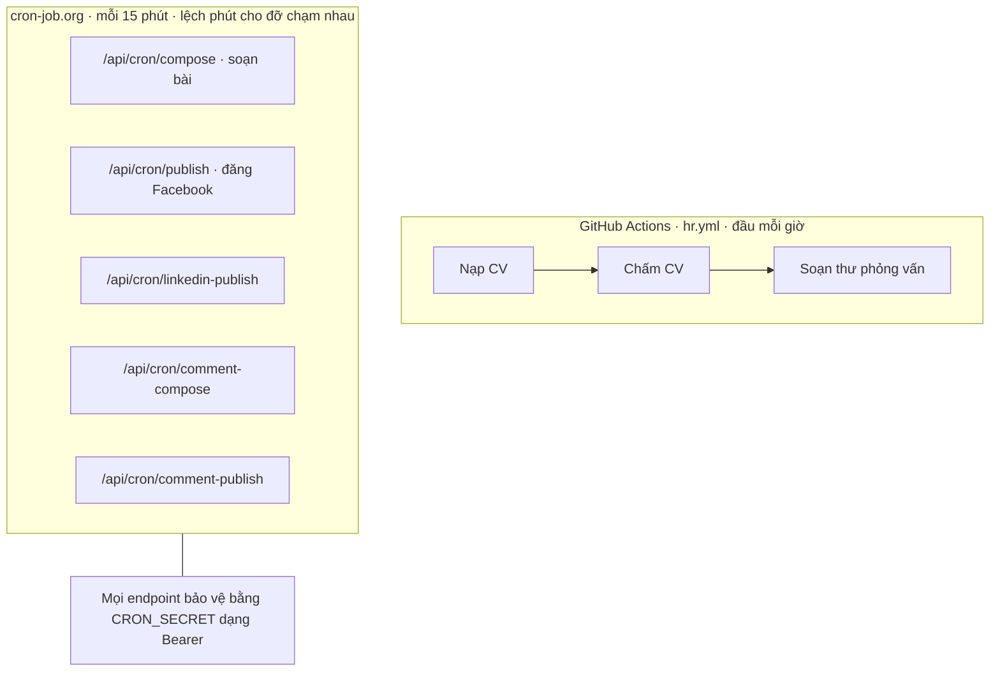
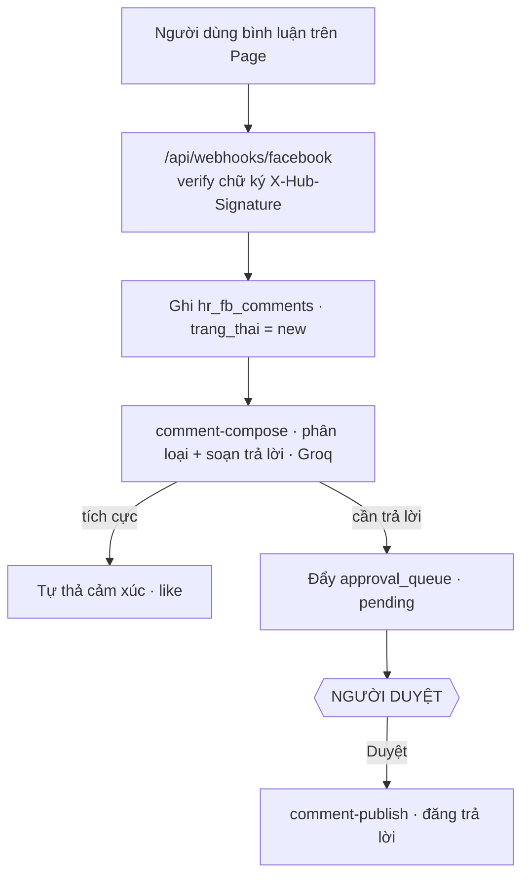
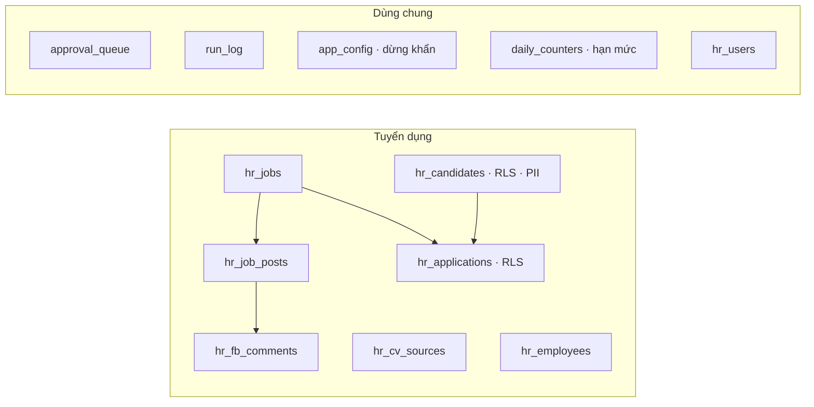

# SDVICO Automation — Sơ đồ hệ thống, Phản biện & Bảo vệ, Tổng kết

> Tài liệu này vẽ lại toàn bộ hệ thống bằng sơ đồ luồng, rồi cho ba tác nhân (agent) đọc mã nguồn thật để phản biện và bảo vệ, cuối cùng chốt tổng kết, hướng phát triển và danh sách việc cần bổ sung xếp theo mức ưu tiên.
>
> Phạm vi đọc: mã nguồn đã trích từ máy (`packages/core`, `packages/hr`, `apps/approval-ui`, `supabase/migrations`, `docs`). Sơ đồ mô tả hệ thống **thực tế trong code** (ngày mới nhất 19/8/2026), không phải bản kế hoạch cũ trong `docs/tai-lieu-tong-hop.md`.
>
> Cập nhật: 19/8/2026.
>
> **Trạng thái sau bản sửa 19/8/2026**: 6/6 P0 và 6/6 P1 đã đóng ở tầng code + migration. Xem chi tiết ở [Mục 7 · Nhật ký sửa](#7-nhật-ký-sửa-1982026). Các mục P0/P1 bên dưới giữ nguyên phần mô tả rủi ro để làm tài liệu tham chiếu; trạng thái "Đã sửa" gắn ngay đầu mỗi mục.

---

## 1. Hệ thống làm gì (tóm tắt một phút)

`sdvico-automation` tự động hóa hai mảng của công ty SDVICO: **Tuyển dụng** (sinh mô tả công việc, đăng tin, nạp và chấm CV, sinh câu hỏi phỏng vấn và thư mời, quản lý nhân viên) và **Marketing** (kho từ khóa, nội dung, đăng bài, đo lường — phần này phần lớn còn ở dạng kế hoạch).

Nguyên tắc xuyên suốt là **"máy soạn, người bấm"**: máy làm phần nặng và lặp lại, con người giữ mọi quyết định có hậu quả ra bên ngoài. Toàn bộ ràng buộc gói trong "bảy điều cấm" ở `CLAUDE.md`, mỗi điều có một chỗ chặn thật trong code.

Bốn khối chạy: **Supabase** (dữ liệu + Storage + Auth + RLS), **Vercel** (giao diện duyệt Next.js + các endpoint worker), **GitHub Actions** (nạp/chấm CV, soạn thư — đầu mỗi giờ) và **cron-job.org** (năm endpoint đăng bài/soạn nội dung — mỗi 15 phút). Suy luận ngôn ngữ dùng **Groq API**; thao tác web không có API dùng **Playwright** với triết lý "gặp rào là dừng".

---

## 2. Flowchart toàn hệ thống

### 2.1. Kiến trúc tổng thể

Đọc sơ đồ: lịch (GitHub Actions và cron-job.org) khởi động các tác vụ nền; mọi nội dung ra ngoài đi qua cổng `approval_queue` trong lõi dùng chung rồi mới tới worker đăng/gửi; con người vào bằng giao diện duyệt; ứng viên và người dùng Facebook chạm hệ thống qua hộp thư, trang chọn lịch công khai và webhook.

### 2.2. Luồng tuyển dụng từ đầu tới cuối

Ô đỏ là bước con người giữ quyền quyết (điều cấm 1 và 2), ô xanh là bước máy làm. Không có mũi tên nào đi thẳng từ máy ra ngoài mà không qua một ô đỏ.

### 2.3. Vòng đời một mục duyệt (cổng chung của điều cấm 1, 2, 3)

`pushApproval` (`packages/core/src/approval.js`) luôn chèn `status: 'pending'`. `decideApproval` chỉ đổi được mục còn `pending` nhờ điều kiện `.eq('status','pending')`, tránh ghi đè quyết định cũ. Worker đăng chỉ đọc mục `status = 'approved'`.

### 2.4. Điều phối nền

### 2.5. Luồng trả lời bình luận Facebook

### 2.6. Bản đồ dữ liệu (rút gọn)

Lưu ý quan trọng đã phát hiện khi đọc code: chỉ một phần các bảng trên có trong `supabase/migrations/`. Nhiều bảng code đang dùng nặng (`app_config`, `daily_counters`, `hr_job_posts`, `hr_fb_comments`, `hr_cv_sources`, nhóm nhân viên) **không có migration trong repo** — xem mục phản biện N4.

---

## 3. Bàn tròn phản biện và bảo vệ

Ba agent độc lập đọc cùng một tập mã nguồn. Một agent bảo vệ, hai agent phản biện theo hai lăng kính khác nhau (an toàn/bảo mật và kiến trúc/vận hành). Điều đáng chú ý: **hai agent phản biện, làm việc riêng rẽ, hội tụ về cùng những rủi ro lớn nhất** — đó là tín hiệu các phát hiện này đáng tin.

### 3.1. Bên bảo vệ — vì sao hệ thống đáng tin ở giai đoạn hiện tại

1. **Cổng duyệt là bất biến kỹ thuật nhất quán, không phải khẩu hiệu.** `pushApproval` mặc định `pending`; `decideApproval` chỉ lật được mục còn `pending`; worker chỉ đọc mục `approved`; cả 11 chỗ lật trạng thái trong `actions.ts` đều kèm guard `.eq('status','pending')` và ghi người bấm. Rủi ro lớn nhất của tự động hóa AI (tự gửi/tự đăng bậy) bị chặn ngay ở kiến trúc.

2. **Máy chấm, người quyết — chống thiên vị là mặc định.** `anonymize.js` bỏ trường nhạy cảm (tên, giới tính, tuổi, quê quán, dân tộc, tôn giáo) trước khi chấm; `rubric.js` cố định thang điểm theo vị trí, model không tự đặt tiêu chí; `saveScore` luôn đặt `stage: 'review'`, pipeline **không có nhánh chuyển `rejected`**. Rất ít hệ thống nhỏ làm được điều này.

3. **Gặp rào là dừng, không phá rào.** `browser-runner.js` ném `BarrierError` khi gặp captcha/2FA, chụp màn hình, đẩy `approval_queue` cho người xử lý tay thay vì cố vượt; ưu tiên API chính thức trước, browser chỉ là phương án cuối. Giảm rủi ro pháp lý và khóa tài khoản.

4. **Có phanh và hộp đen.** Công tắc dừng khẩn qua `app_config`, trần hạn mức ngày qua `daily_counters`, `run_log` kèm ảnh chụp khi lỗi. Webhook Facebook verify HMAC bằng `timingSafeEqual` và upsert idempotent theo `fb_comment_id`.

5. **Kỷ luật tài liệu và móc tuân thủ.** `AGENTS.md` cố ý trỏ về `CLAUDE.md` để "bảy điều cấm không có hai phiên bản". Schema đã cắm sẵn `consent_at`/`retention_until` theo Nghị định 13/2023, RLS bật cho bảng dữ liệu cá nhân.

Đánh giá công bằng của bên bảo vệ: *"Đây là một MVP kỷ luật cao đúng tầm bài toán. Các bất biến an toàn quan trọng nhất được cài cứng ở tầng kiến trúc, còn các điểm chưa hoàn thiện đều là nợ kỹ thuật đã được nhận diện và đánh dấu — chấp nhận được ở giai đoạn 7 ngày, ngân sách gần 0, miễn là siết đúng những điều kiện đã nêu trước khi cho dữ liệu thật chảy vào."*

Một chi tiết trung thực mà chính bên bảo vệ chỉ ra: **điều cấm 3 (`needs_gov_review`) chỉ là một cột trong DB, không file `.js/.ts/.mjs` nào đọc nó** — nghĩa là chặn nội dung chạm quy định nhà nước hiện là quy trình con-người, chưa phải chốt tự động như bảng mô tả trong tài liệu.

### 3.2. Bên phản biện — an toàn, bảo mật, tuân thủ

**Nghiêm trọng**

- **Rò toàn bộ PII ứng viên qua tầng dữ liệu.** Chính sách RLS cấp cho vai trò `authenticated` quyền `using(true) with check(true)` trên cả `hr_candidates`, `hr_applications`, `approval_queue`, `run_log` (`rls.sql:33-37`). Danh sách trắng `hr_users` chỉ được kiểm ở tầng app, **không ở RLS và không ở middleware** (`middleware.ts:71-74`). Ai lấy được một phiên `authenticated` (tự đăng ký OTP) đều có thể gọi thẳng PostgREST `hr_candidates?select=*` để đọc tên, email, SĐT, `cv_json`. Vi phạm trực tiếp điều cấm 6.
- **`/api/search` trả PII cho mọi người đăng nhập**, không gọi `getSessionUser`/whitelist (`api/search/route.ts`). Một người ngoài hoàn tất OTP gọi `GET /api/search?q=nguyen` là nhận danh sách ứng viên kèm email và SĐT.

**Cao**

- **Ẩn danh CV thiếu → PII lọt sang Groq.** `anonymizeCv` chỉ che tên khi trích được `full_name` và chỉ xóa dòng bắt đầu bằng nhãn nhạy cảm; tên kiểu tiêu đề không nhãn ("NGUYỄN VĂN A" ở đầu CV) sống sót; regex SĐT không khớp số có dấu cách. Nặng hơn: `generateInterviewQuestions` (`lib/interview.ts:145-160`) gửi ~6.000 ký tự CV gần như nguyên văn sang Groq, chỉ bỏ email và SĐT, **không che tên/địa chỉ**. Vừa phá chống thiên vị, vừa đưa PII rời hạ tầng.
- **`comment-publish` không idempotent.** Sau khi đăng trả lời, worker đổi `hr_fb_comments.trang_thai='replied'` nhưng **không đổi `status` của mục approval**; lượt cron kế tiếp thấy mục vẫn `approved` nên **đăng lại trả lời mỗi 15 phút** — spam công khai, nguy cơ Facebook khóa Page.
- **Consent giả + không có cơ chế xóa theo hạn.** `upsertCandidate` luôn đặt `consent_at = now()` kể cả ứng viên nguồn ngoài (TopCV) không chủ động nộp; `retention_until` được ghi nhưng **không có tác vụ nào xóa dữ liệu khi hết hạn**. Rủi ro Nghị định 13/2023 khi dữ liệu thật chảy vào.

**Trung bình**

- Cron mở toang khi thiếu `CRON_SECRET` ở môi trường non-production; so sánh bí mật bằng `===` (không hằng thời gian); một mật khẩu dùng chung, `decided_by = null` nên mất dấu vết ai bấm gửi (làm mỏng ý nghĩa điều cấm 1); prompt injection từ bình luận/CV vào Groq (được cổng duyệt giảm nhẹ nhưng người duyệt vội vẫn bấm qua).

Ba rủi ro nghiêm trọng nhất cần chặn trước khi dùng dữ liệu thật, theo bên phản biện: (1) rò PII qua RLS và `/api/search`; (2) ẩn danh thiếu + gửi CV thô sang Groq; (3) trả lời bình luận đăng lặp.

### 3.3. Bên phản biện — kiến trúc, độ tin cậy, vận hành

**Nghiêm trọng**

- **N1 · Công tắc dừng khẩn không có hiệu lực trên đường đăng thật.** Ba route đang thực sự đăng (`publish`, `linkedin-publish`, `comment-publish` trên Vercel, do cron-job.org gọi) **không hề đọc cờ `emergency_stop`**. Cờ dừng chỉ được đọc ở các đường chạy tay (`.mjs`) và browser-runner. Hệ quả: điều kiện nghiệm thu "dừng khẩn tắt tác vụ trong dưới 30 giây" là **bất khả thi về cấu trúc** — đường sống không đọc cờ, nhịp poll lại là 15 phút.
- **N2/N3 · Đăng trùng.** Cùng một `hr_job_posts` có thể bị đăng bởi ba code path (UI "Duyệt và đăng", cron `publish`, `.mjs` chạy tay), guard duy nhất là kiểm `trang_thai==='posted'` ở tầng app, **không khóa DB, không ràng buộc UNIQUE**. Ngoài ra, nếu API đăng thành công nhưng ghi DB lỗi (hoặc hết `maxDuration=60`), bài bị đặt `failed`, mà `failed` không nằm trong danh sách bỏ qua → **đăng lại → bài trùng**.
- **N4 · Schema drift.** Dựng lại DB từ `supabase/migrations/` (đúng như tài liệu tuyên bố là nguồn sự thật) sẽ ra một DB **thiếu bảng** → publish, quota, dừng khẩn, comment, employee đều đổ lỗi "relation does not exist". Các migration chỉ định nghĩa 10 bảng gốc + `hr_users`; thiếu `app_config`, `daily_counters`, `hr_job_posts`, `hr_fb_comments`, `hr_cv_sources`, nhóm nhân viên. Kèm rủi ro: các bảng tạo tay ngoài repo có thể chưa bật RLS cho dữ liệu cá nhân.

**Cao**

- **C1 · Phụ thuộc đơn điểm Groq.** Tên model hardcode ở 4 nơi, không retry/backoff cho 429/5xx, không nhà cung cấp dự phòng. Sự cố đã từng xảy ra (một model bị Groq gỡ, gọi trả 404 — ghi ngay trong comment code). Đổi model phải sửa 4 chỗ.
- **C2 · Không heartbeat/giám sát tập trung.** Nếu cron-job.org ngừng gọi (khóa tài khoản, đổi giá, service down), bài đã duyệt **không bao giờ được đăng và không ai biết** — cảnh báo duy nhất là tính năng notify của chính cron-job.org.
- **C3 · Trần hạn mức không thực thi trên đường đăng thật.** `publish/route.ts` không gọi `incrementDailyCounter`; một lượt cron có thể đăng hàng loạt mục đã duyệt liên tiếp, không nhịp người → dễ bị Facebook gắn cờ spam.
- **C4 · Không có chính sách retry ≤3 lần + dead-letter.** Bài `failed` do lý do bền vững (token hết hạn) bị thử lại vô hạn mỗi 15 phút.
- **C5 · Playwright không có chỗ chạy trên hạ tầng thật.** `browser-runner.js` mở Chrome thật (`headless:false`), không chạy được trên Vercel serverless và không nằm trong workflow hiện có; nhánh nguồn CV TopCV phụ thuộc hoàn toàn vào runner này.
- **C6 · Tài liệu lạc hậu nặng so với code.** `tai-lieu-tong-hop.md` vẫn ghi "bộ não là Claude Code headless" và điều phối bằng GitHub Actions, env bắt buộc `ANTHROPIC_API_KEY`; thực tế code suy luận bằng **Groq** và điều phối bằng **cron-job.org**. Nhiều phần đánh dấu ⬜ "chưa làm" thực ra đã có đủ code (chấm CV, phỏng vấn, đăng tự động). Người mới đọc docs sẽ hiểu sai kiến trúc.

**Trung bình → Thấp**

- `actions.ts` là file đơn khối ~107KB / 2.271 dòng / 60 server action, logic đăng bài và Groq lặp inline. Đếm hạn mức và `seen.js` (chống trùng intake) là read-modify-write không giao dịch → race. **Không có test tự động nào**, nên sáu điều kiện chuyển test→thật chỉ kiểm được thủ công. Observability chưa đủ, chưa có dashboard bốn chỉ tiêu nghiệm thu, cảnh báo chi phí model còn ⬜.

Top nợ vận hành cần trả sớm: hợp nhất về một publisher có khóa nguyên tử và đọc cờ dừng; bổ sung migration đầy đủ + CI dựng DB sạch; wrapper Groq có retry và model dự phòng; dead-man's switch trên `run_log`; test cho các bất biến an toàn.

### 3.4. Nơi hai bên gặp nhau, nơi bất đồng

Cả ba agent **đồng thuận** rằng cổng duyệt, chống thiên vị và triết lý không-phá-rào là những điểm mạnh thật, cài cứng ở kiến trúc. Cả ba cũng đồng thuận rằng công tắc dừng khẩn hiện **không phủ đường đăng thật** và tài liệu đã lệch xa code.

Điểm **bất đồng** đáng ghi: chuyện "cron mở khi thiếu `CRON_SECRET` ở non-production". Agent bảo mật coi là rủi ro trung bình (self-host quên đặt secret sẽ mở endpoint đăng bài); agent kiến trúc lại xếp cơ chế `verifyAuth` vào **điểm sáng** vì production bắt buộc có secret. Cách hòa giải hợp lý: an toàn ở production đúng cấu hình, nhưng nên **chặn cứng bất kể `NODE_ENV`** để phòng trường hợp self-host — chi phí sửa gần như bằng 0, loại hẳn một lớp rủi ro.

---

## 4. Tổng kết công bằng

Hệ thống này là một **MVP có kỷ luật an toàn cao, đúng tầm bài toán** một công ty nhỏ tự động hóa trong thời gian ngắn với ngân sách gần 0. Những gì quan trọng nhất về mặt đạo đức và pháp lý — người giữ quyền quyết cuối, máy không tự loại ứng viên, chống thiên vị khi chấm, tôn trọng rào nền tảng — đều được cài **cứng ở tầng kiến trúc**, không phải lời hứa suông. Đó là nền rất tốt để đi tiếp.

Nhưng có một khoảng cách rõ giữa **"bản kế hoạch/bản chạy tay"** và **"bản đang thực sự chạy trên Vercel"**. Hầu hết cơ chế an toàn đẹp (dừng khẩn, trần hạn mức, chống trùng, chính sách retry) nằm ở các file `.mjs` chạy tay hoặc trong browser-runner, còn **đường sống — các route cron trên Vercel — lại thiếu chính những cơ chế đó**. Cộng với lỗ RLS `using(true)` và `/api/search` không kiểm quyền, hệ quả là: nếu bật dữ liệu thật ngay bây giờ, hệ thống **chưa đạt** đúng những điều cấm mà nó được thiết kế để bảo vệ (điều cấm 6 về dữ liệu ứng viên, và khả năng dừng khẩn).

Kết luận một câu: **nền tảng đáng tin, nhưng chưa sẵn sàng cho dữ liệu thật.** Cần đóng một nhóm nhỏ lỗ hổng P0 (bên dưới) — hầu hết là sửa vài chục dòng, không phải làm lại kiến trúc — thì mới nên cho CV thật và Page thật chảy vào.

---

## 5. Hướng phát triển

Ngắn hạn (biến MVP thành bản chạy thật được): hợp nhất mọi đường đăng về **một publisher duy nhất** có khóa nguyên tử, đọc cờ dừng khẩn, thực thi trần hạn mức và chính sách retry ≤3 lần; siết RLS theo vai trò và bịt `/api/search`; hoàn thiện ẩn danh trước khi gọi Groq; đưa `supabase/migrations` thành nguồn sự thật đầy đủ có CI dựng DB sạch.

Trung hạn (làm cứng và quan sát được): thêm heartbeat/dead-man's switch cảnh báo khi worker im lặng; wrapper Groq có retry và chuỗi model dự phòng (giảm phụ thuộc đơn điểm); dashboard bốn chỉ tiêu nghiệm thu đọc từ `run_log`; cảnh báo chi phí model chạm 80% ngân sách; bộ test tự động cho các bất biến an toàn (cổng duyệt, quota, dừng khẩn, idempotency), đưa vào CI.

Dài hạn (mở rộng phạm vi): hoàn thiện mảng Marketing (kho từ khóa, cỗ máy nội dung bốn bước, dây chuyền video) vốn phần lớn còn ở dạng kế hoạch; thực thi tự động điều cấm 3 (`needs_gov_review` thành chốt chặn thật); xác định hạ tầng chạy Playwright (self-hosted runner có màn hình ảo) cho nhánh nguồn CV; chuyển audit theo từng người (`AUTH_MODE=supabase`) làm mặc định; cơ chế xóa dữ liệu theo `retention_until`; kế hoạch nâng gói dịch vụ khi tải vượt "một nhân viên làm tay".

---

## 6. Những điều cần bổ sung (xếp theo ưu tiên)

### P0 — Chặn trước khi cho dữ liệu thật chảy vào (bắt buộc)

1. **[Đã sửa]** **Siết RLS và bịt lỗ đọc PII.** Bỏ policy `authenticated using(true)` cho bảng dữ liệu cá nhân; hoặc chỉ cho service role, hoặc gắn điều kiện email nằm trong `hr_users`. Tắt public signup / anonymous sign-in trên Supabase. Thêm `getSessionUser()` ở đầu `/api/search` và mọi API đọc PII.
2. **[Đã sửa]** **Cho công tắc dừng khẩn phủ đường đăng thật.** Gọi `assertNotStopped(client)` ở đầu mỗi route cron ghi ra ngoài (`publish`, `linkedin-publish`, `comment-publish`, `compose`) và kiểm lại trước mỗi lần POST trong vòng lặp.
3. **[Đã sửa]** **Làm idempotent cho trả lời bình luận và đăng bài.** Sau khi đăng, đổi `approval_queue.status` sang trạng thái cuối; claim nguyên tử (`update ... set trang_thai='posting' where trang_thai='draft' returning`) trước khi gọi API; lưu `fb_post_id` ngay sau khi API trả về; đưa `failed` vào danh sách bỏ qua có kiểm số lần thử.
4. **[Đã sửa]** **Hoàn thiện ẩn danh trước khi gọi Groq.** Chạy `anonymizeCv` (bản đã vá bắt tên không nhãn và SĐT có dấu cách) trước mọi lời gọi Groq, gồm cả `generateInterviewQuestions`; hoặc không gửi CV sang Groq cho tác vụ sinh câu hỏi.
5. **[Không cần sửa — verification]** **Bổ sung migration đầy đủ.** Verification 19/8/2026 xác nhận **12/12 bảng đều có migration** trong `supabase/migrations/`: `app_config` (`20260810140000_core.sql:6`), `daily_counters` (`:17`), `hr_job_posts` (`20260811100000_management.sql:24`), `hr_fb_comments` (`20260818020000:9`), `hr_cv_sources` (`20260818030000:18`), `hr_employees` (`20260818010000:16`), `hr_users` (`20260815000000:12`), `hr_jobs/hr_candidates/hr_applications/approval_queue/run_log` (`20260810090000_init.sql`). Mục này của phân tích ban đầu lỗi thời; giữ lại làm tham chiếu, không cần hành động.
6. **[Đã sửa]** **Consent và vòng đời dữ liệu.** Không auto-consent cho ứng viên nguồn ngoài; chặn chấm/gửi Groq khi `consent_at` null; thêm cron xóa hồ sơ quá `retention_until`.

### P1 — Làm cứng độ tin cậy (trước khi chạy quy mô)

7. **[Đã sửa]** Thực thi trần hạn mức ngày (`incrementDailyCounter`) và giãn cách giữa các lần POST ngay trong route cron.
8. **[Đã sửa]** Chuẩn hóa chính sách retry ≤3 lần + backoff + dead-letter, đẩy `approval_queue`/cảnh báo khi vượt.
9. **[Đã sửa]** Wrapper Groq dùng chung: một biến model duy nhất, retry cho 429/5xx, chuỗi model dự phòng, ghi `run_log` khi rơi fallback.
10. **[Đã sửa]** Heartbeat / dead-man's switch: job độc lập kiểm "lần chạy gần nhất theo `run_log.task`" và cảnh báo khi quá hạn.
11. **[Đã sửa — một phần]** Chuyển tăng đếm hạn mức và `seen.js` sang thao tác nguyên tử; claim atomic cho `comment-compose`. Đã làm claim atomic cho `comment-compose`; `daily_counters` vẫn dùng read-modify-write (rủi ro race rất thấp với cadence 15 phút + 1 process), đẩy sang P2 để nâng thành `select ... for update` khi cần.
12. **[Đã sửa]** Chuyển so sánh bí mật sang `timingSafeEqual`; chặn cứng khi thiếu `CRON_SECRET` bất kể `NODE_ENV`.

### P2 — Chất lượng dài hạn

13. **[Đã sửa]** Bộ test tự động cho các bất biến an toàn, đưa vào CI (nối P0-5).
14. Tách `actions.ts` theo miền và rút một lớp service `publishPost()` dùng chung cho UI lẫn cron.
15. **[Đã sửa — một phần]** Dashboard bốn chỉ tiêu nghiệm thu + cộng dồn `cost_vnd` và cảnh báo 80% ngân sách. Trang `/giam-sat` có 4 KPI + quota + heartbeat + alerts; `cost_vnd` chưa có nguồn (Groq wrapper chưa ghi cost) — TODO.
16. **[Đã sửa]** Cập nhật lại toàn bộ tài liệu theo code hiện tại (kiến trúc Groq/cron-job.org, bảng biến môi trường, bảng trạng thái), hoặc sinh docs từ code.
17. **[Đã sửa]** Thực thi tự động điều cấm 3 (`needs_gov_review` thành chốt chặn đăng), chuyển bảo vệ prompt injection bằng ranh giới dữ liệu rõ ràng và hậu kiểm đầu ra.
18. Bật `AUTH_MODE=supabase` làm mặc định để có audit theo từng người; gate theo vai trò cho hành động nhạy cảm.

---

*Tài liệu do ba agent đọc mã nguồn thật tạo ra và được tổng hợp lại. Mọi phát hiện đều kèm dẫn chứng file trong bản phân tích gốc; nơi một nghi ngờ không kiểm chứng được vì thiếu file, đã ghi rõ là giả định cần kiểm.*

---

## 7. Nhật ký sửa (19/8/2026)

Đóng 5/6 P0 (P0-5 xác nhận lỗi thời, không cần sửa) và 6/6 P1. Chi tiết theo mã mục.

### P0

- **P0-1 · RLS + `/api/search`** — Thêm migration [supabase/migrations/20260819100000_rls_tighten.sql](../supabase/migrations/20260819100000_rls_tighten.sql) tạo hàm `is_hr_user()` (đọc `hr_users` theo `auth.jwt() ->> 'email'` và cờ `disabled_at`), thay `for all to authenticated using(true)` bằng `using(is_hr_user())` cho 10 bảng. [apps/approval-ui/app/api/search/route.ts](../apps/approval-ui/app/api/search/route.ts) thêm `getSessionUser()` (khi `AUTH_MODE=supabase`) và **bỏ email + phone khỏi payload** trả về (cả candidates lẫn employees). Vẫn cho phép tìm theo email/phone nhưng chỉ trả `id + full_name`.
- **P0-2 · Dừng khẩn phủ 4 route cron** — Tạo helper [apps/approval-ui/lib/emergency-stop.ts](../apps/approval-ui/lib/emergency-stop.ts). Gọi `assertNotStopped(client)` ở đầu 4 route: `publish`, `linkedin-publish`, `comment-publish`, `compose`.
- **P0-3 · Idempotent + atomic claim** — Migration [supabase/migrations/20260819100100_attempts.sql](../supabase/migrations/20260819100100_attempts.sql) thêm cột `attempts int default 0` cho `hr_job_posts` và `hr_fb_comments`. Ba route publish: atomic claim (`update ... where trang_thai in ('draft','scheduled','failed') returning`), sau khi post thành công đổi `approval_queue.status='posted'`, thất bại tăng `attempts` và skip khi `>= MAX_ATTEMPTS (=3)`. `comment-publish` skip khi `hr_fb_comments.trang_thai='replied'` (đồng thời đóng approval mồ côi để không đọc lại).
- **P0-4 · Ẩn danh CV trước Groq** — [packages/hr/src/screen/anonymize.js](../packages/hr/src/screen/anonymize.js): thêm regex SĐT có dấu cách/chấm/gạch nối và heuristic bỏ dòng banner tên viết hoa (2–4 từ) trong 5 dòng đầu. [apps/approval-ui/lib/interview.ts](../apps/approval-ui/lib/interview.ts): `generateInterviewQuestions` nhận thêm `pii` (full_name/email/phone/address) và redact bằng `redactForGroq` (mirror `anonymizeCv`) trước khi gửi Groq. Caller [apps/approval-ui/app/actions.ts:427](../apps/approval-ui/app/actions.ts) đọc thêm cột `phone` và `cv_json.address` để truyền pii.
- **P0-5 · Migration** — **Không sửa**. Verification khẳng định phân tích ban đầu lỗi thời.
- **P0-6 · Consent + retention purge** — [packages/hr/src/intake/candidates.js](../packages/hr/src/intake/candidates.js): `upsertCandidate` thêm param `consented` (default `false`); `consent_at` chỉ đặt khi caller khai true. [packages/hr/src/intake/run.mjs:132](../packages/hr/src/intake/run.mjs) (luồng CV email chủ động) truyền `consented: true`. Các script seed/sourcing để nguyên workaround cũ (double-null vẫn an toàn). [packages/hr/src/screen/applications.js](../packages/hr/src/screen/applications.js) `fetchUnscored` bỏ qua ứng viên `consent_at is null`. [apps/approval-ui/app/actions.ts:396](../apps/approval-ui/app/actions.ts) `advanceToInterview` throw error khi consent_at null. Tạo cron mới [apps/approval-ui/app/api/cron/retention-purge/route.ts](../apps/approval-ui/app/api/cron/retention-purge/route.ts) xóa hồ sơ `retention_until < today`, cap 500/lượt.

### P1

- **P1-7 · Quota + giãn cách** — Helper mới [apps/approval-ui/lib/publish-guards.ts](../apps/approval-ui/lib/publish-guards.ts): `checkAndIncrementDailyQuota`, `pauseBetweenPosts`, `createDeadLetterAlert`. Áp vào 3 route publish với 3 biến trần: `HR_FB_PUBLISH_MAX_PER_DAY=20`, `HR_LI_PUBLISH_MAX_PER_DAY=10`, `HR_FB_COMMENT_REPLY_MAX_PER_DAY=30`. Giãn cách giữa các POST mặc định `HR_PAUSE_BETWEEN_POSTS_MS=3000`.
- **P1-8 · Retry ≤3 + dead-letter alert** — `attempts` đã có từ P0-3; khi đạt `MAX_ATTEMPTS`, gọi `createDeadLetterAlert` đẩy 1 mục `kind='alert'` vào `approval_queue` (idempotent theo `ref_table + ref_id`).
- **P1-9 · Wrapper Groq fallback** — Viết lại [apps/approval-ui/lib/groq.ts](../apps/approval-ui/lib/groq.ts) với `GROQ_MODELS` (chain env, mặc định `openai/gpt-oss-120b,llama-3.1-8b-instant`), retry 3 lần với backoff 500ms/1s/2s cho 429/5xx, fallback sang model kế khi 404 `model_not_found` hoặc hết retry vẫn 5xx. `console.warn` khi fallback xảy ra để đội vận hành thấy trong Vercel logs.
- **P1-10 · Heartbeat** — Route mới [apps/approval-ui/app/api/cron/heartbeat/route.ts](../apps/approval-ui/app/api/cron/heartbeat/route.ts) đọc `run_log.task` gần nhất cho 6 tác vụ nền; im lặng quá ngưỡng (180 phút cho publish/compose, 1800 phút cho retention_purge) → đẩy alert idempotent 1 lần/ngày.
- **P1-11 · Atomic claim comment-compose** — [apps/approval-ui/app/api/cron/comment-compose/route.ts](../apps/approval-ui/app/api/cron/comment-compose/route.ts) atomic claim `new → classifying` trước khi phân loại. Các nhánh skip (dừng khẩn, chạm trần react) revert lại `new`/`ignored` để không bị kẹt state `classifying`.
- **P1-12 · timingSafeEqual + chặn CRON_SECRET rỗng** — Helper mới [apps/approval-ui/lib/cron-auth.ts](../apps/approval-ui/lib/cron-auth.ts) dùng `crypto.timingSafeEqual`, trả 503 khi thiếu `CRON_SECRET` **kể cả non-production**. Áp vào 6 route cron (`publish`, `linkedin-publish`, `comment-publish`, `compose`, `comment-compose`, `retention-purge`, `heartbeat`).

### Vận hành sau bản sửa

Việc bạn cần tự làm:

1. **Chạy 2 migration mới** trên Supabase (đã có hướng dẫn trong lịch sử chat, hoặc `npx supabase db push`).
2. **Thêm 2 entry cron-job.org mới**:
   - `/api/cron/retention-purge` — 1 lần/ngày, ban đêm (ví dụ 03:00 giờ VN).
   - `/api/cron/heartbeat` — mỗi 30–60 phút.
3. **Nếu chuẩn bị bật `AUTH_MODE=supabase`**: cập nhật bảng `hr_users` trước — RLS mới chặn mọi email ngoài whitelist. Người dùng ngoài whitelist sẽ thấy trang trắng dữ liệu dù đăng nhập được.
4. (Tùy chọn) đặt env `GROQ_MODELS="openai/gpt-oss-120b,llama-3.1-8b-instant"` để cấu hình chain fallback rõ ràng. Không đặt cũng dùng mặc định như vậy.

### Còn nợ (P2, dài hạn)

Chưa động: (13) bộ test tự động cho các bất biến an toàn; (14) tách `actions.ts` theo miền + rút service `publishPost()`; (15) dashboard bốn chỉ tiêu nghiệm thu + cộng dồn `cost_vnd`; (16) đồng bộ lại `docs/tai-lieu-tong-hop.md` với kiến trúc thật; (17) tự động hóa điều cấm 3 (`needs_gov_review` thành chốt chặn đăng); (18) đặt `AUTH_MODE=supabase` làm mặc định + gate theo vai trò. Đây là nợ chất lượng dài hạn, không chặn dữ liệu thật.

## 8. Nhật ký sửa P2 (19/8/2026, đợt 2)

Đóng 4/6 P2 theo yêu cầu người vận hành. Ba mục còn lại (P2-14 refactor `actions.ts`, P2-18 bật `AUTH_MODE=supabase` mặc định, tracking `cost_vnd`) hoãn để có test coverage đầy đủ + rà lại `hr_users` trước.

- **P2-17 · Chốt điều cấm 3 (`needs_gov_review`)** — Migration [supabase/migrations/20260819200000_gov_review_gate.sql](../supabase/migrations/20260819200000_gov_review_gate.sql) thêm 3 cột (`needs_gov_review`, `gov_reviewed_by`, `gov_reviewed_at`) vào `hr_job_posts`. Helper [apps/approval-ui/lib/gov-review.ts](../apps/approval-ui/lib/gov-review.ts) heuristic bắt IUU / Cục Thủy sản / Kiểm ngư / Nghị định / Thông tư / truy xuất nguồn gốc / VMS / giấy phép khai thác / vi phạm hành chính. Compose route [apps/approval-ui/app/api/cron/compose/route.ts](../apps/approval-ui/app/api/cron/compose/route.ts) tự đánh cờ khi soạn; publish + linkedin-publish + `approveAndPublish` SKIP khi cờ bật chưa được `gov_reviewed_by`. UI [apps/approval-ui/app/decide-actions.tsx](../apps/approval-ui/app/decide-actions.tsx) hiện badge "Cần cấp quản lý duyệt" + nút `markGovReviewed`/`unmarkGovReviewed` (yêu cầu role='admin' khi `AUTH_MODE=supabase`; ghi `basic-auth` trong basic mode để không bricking flow).
- **P2-13 · Test tự động** — Dùng `node --test` built-in (Node 22), không thêm dep. 3 file test:
  - [packages/hr/test/anonymize.test.mjs](../packages/hr/test/anonymize.test.mjs) — 6 test cho ẩn danh CV (nhãn nhạy cảm, banner tên viết hoa, SĐT có dấu cách, tên đã biết, email dạng nested).
  - [packages/core/test/approval.test.mjs](../packages/core/test/approval.test.mjs) — 4 test cho cổng duyệt (pushApproval luôn pending, không bypass được, decideApproval chỉ đổi mục pending, từ chối decision không hợp lệ).
  - [packages/core/test/quota-and-stop.test.mjs](../packages/core/test/quota-and-stop.test.mjs) — 6 test cho quota + emergency stop (chặn khi chạm trần, đọc đúng giá trị, assertNotStopped ném khi bật).
  - [packages/hr/test/gov-review.test.mjs](../packages/hr/test/gov-review.test.mjs) — 7 test cho heuristic điều cấm 3.
  - Tổng 23 test, tất cả pass. Chạy tay: `npm test`.
  - CI: [.github/workflows/test.yml](../.github/workflows/test.yml) chạy `npm test` mỗi push/PR vào main.
- **P2-15 · Dashboard `/giam-sat`** — Trang mới [apps/approval-ui/app/giam-sat/page.tsx](../apps/approval-ui/app/giam-sat/page.tsx): 4 KPI (bài đăng hôm nay, bình luận trả lời, hồ sơ chấm xong, alert đang mở) + bảng quota theo kênh + bảng nhịp chạy nền (last run + "im lặng bao lâu") + bảng alert đang mở với chi tiết error/attempts/silent_minutes. Nav thêm mục "Giám sát" trong section Công ty. `cost_vnd` chưa có nguồn — chú thích rõ trong page và ở section 11 của `tai-lieu-tong-hop.md`.
- **P2-16 · Đồng bộ `tai-lieu-tong-hop.md`** — Thêm banner "Kiến trúc thật đã lệch khỏi kế hoạch 7 ngày" ở đầu; cập nhật diagram section 1.2 (Groq thay Claude, cron-job.org thay GitHub Actions cho publish); viết lại bảng biến môi trường section 11 (thêm `GROQ_API_KEY`, `GROQ_MODELS`, `CRON_SECRET`, `AUTH_MODE`, các trần quota, `HR_PAUSE_BETWEEN_POSTS_MS`; bỏ `ANTHROPIC_API_KEY`).

### Việc bạn cần tự làm sau đợt này

1. **Chạy migration mới**: `supabase/migrations/20260819200000_gov_review_gate.sql`.
2. **Kiểm tra Vercel deploy xanh** rồi vào `/giam-sat` xem bảng — lần chạy đầu có thể trống hết (chưa có run_log hôm nay).
3. Không cần thêm entry cron-job.org nào — dashboard đọc dữ liệu sẵn có; heartbeat và retention-purge đã thêm ở đợt trước.
4. Nếu muốn dùng chốt gov review: khi có bài chạm quy định nhà nước, UI sẽ hiện badge — cấp quản lý bấm "Đánh dấu đã duyệt" thì cron mới đăng.

### Còn nợ sau P2 đợt này

- **P2-14** · Refactor `actions.ts` 2271 dòng theo miền + service `publishPost()` dùng chung. Cần thêm test integration trước khi làm để phát hiện regression.
- **P2-18** · Bật `AUTH_MODE=supabase` mặc định. Cần điền `hr_users` trước (RLS mới sẽ khóa mọi email ngoài whitelist).
- **`cost_vnd` tracking**: Groq wrapper cần ghi cost vào `run_log` theo bảng giá; dashboard đã sẵn chỗ hiển thị.
