# Tài liệu tổng hợp hệ thống sdvico-automation

> Một chỗ đọc là hiểu toàn bộ: kế hoạch 7 ngày, từng phần làm gì, đầu vào đầu ra ra sao, code chạy thế nào, và sơ đồ luồng cho mỗi phần.
>
> Nguồn sự thật khi có mâu thuẫn: `CLAUDE.md` (bảy điều cấm, giọng văn), `supabase/migrations` (lược đồ), `docs/ke-hoach-7-ngay.md` (kế hoạch gốc). Tài liệu này diễn giải và nối chúng lại, không thay thế.
>
> Sơ đồ vẽ bằng Mermaid, xem đẹp nhất trên GitHub hoặc trình xem Markdown có hỗ trợ Mermaid.
>
> Cập nhật: 10/8/2026.

## Chú thích trạng thái

| Ký hiệu | Nghĩa |
|---|---|
| ✅ | Đã làm và đã chạy thử |
| 🟡 | Đang làm dở |
| ⬜ | Chưa làm, theo lịch ngày sau |

## Mục lục

1. [Tổng quan hệ thống](#1-tổng-quan-hệ-thống)
2. [Lịch 7 ngày và trạng thái](#2-lịch-7-ngày-và-trạng-thái)
3. [Nền chung: packages/core](#3-nền-chung-packagescore)
4. [Cơ sở dữ liệu và RLS](#4-cơ-sở-dữ-liệu-và-rls)
5. [Giao diện duyệt](#5-giao-diện-duyệt)
6. [Mảng Tuyển dụng](#6-mảng-tuyển-dụng)
7. [Mảng Marketing](#7-mảng-marketing)
8. [Đăng tự động bằng Playwright](#8-đăng-tự-động-bằng-playwright)
9. [Đo lường và làm cứng](#9-đo-lường-và-làm-cứng)
10. [Chuyển sang tài khoản thật và bàn giao](#10-chuyển-sang-tài-khoản-thật-và-bàn-giao)
11. [Cần cung cấp: biến môi trường và tài khoản](#11-cần-cung-cấp-biến-môi-trường-và-tài-khoản)
12. [Cách chạy nhanh](#12-cách-chạy-nhanh)

---

## 1. Tổng quan hệ thống

### 1.1. Mục tiêu

Tự động hóa hai mảng của SDVICO trong khối lượng một nhân viên làm tay cũng làm được:

- Tuyển dụng: sinh mô tả công việc, nạp và chuẩn hóa CV, chấm điểm, sinh câu hỏi phỏng vấn và thư mời.
- Marketing: kho từ khóa, cỗ máy nội dung, đăng bài, dựng video, đo lường.

Nguyên tắc xuyên suốt: máy soạn, người bấm. Máy làm phần nặng và lặp lại, con người giữ mọi quyết định có hậu quả ra bên ngoài.

### 1.2. Kiến trúc

Bốn khối: nơi khởi động (điều phối), bộ não ngôn ngữ, lõi dùng chung, và nơi lưu trữ. Thao tác web đi qua Playwright khi không có API.

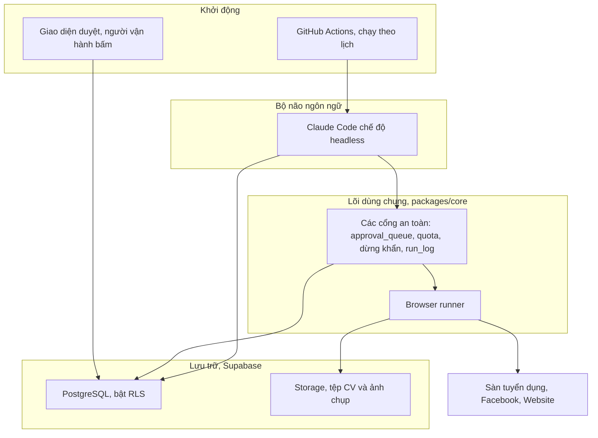

Đọc sơ đồ: lịch GitHub Actions gọi các tác vụ, tác vụ nhờ Claude Code suy luận nội dung, mọi kết quả đi qua các cổng an toàn trong `packages/core` rồi vào Supabase. Khi phải thao tác web mà không có API, browser runner mở Chrome thật, luôn dừng trước nút gửi cuối để người duyệt. Người vận hành làm việc qua giao diện duyệt, chỉ đọc ghi bảng trong Supabase.

### 1.3. Cấu trúc repo

```
sdvico-automation/
  CLAUDE.md              bộ não dùng chung, đọc trước tiên
  .claude/skills/        brand-voice, product-boundary, cv-screening, seo-brief
  .claude/commands/      hr-jd, hr-intake, mkt-brief, mkt-draft, mkt-publish
  packages/core/         client Supabase, run_log, approval_queue, quota, dừng khẩn, browser runner
  packages/hr/           mảng Tuyển dụng
  packages/marketing/    mảng Marketing
  apps/approval-ui/      giao diện duyệt, Next.js
  supabase/migrations/   lược đồ và RLS
  .github/workflows/     lịch chạy
  docs/                  kế hoạch, app map, tài liệu này
```

### 1.4. Bảy điều cấm và nơi thực thi trong code

Điều cấm không phải khẩu hiệu, mỗi điều có một chỗ chặn thật trong hệ thống.

| Điều cấm | Nội dung | Thực thi ở đâu |
|---|---|---|
| 1 | Máy soạn, người bấm gửi | Mọi thư và bài đi qua `approval_queue`, mặc định `pending`. Không nhánh nào gọi thẳng hàm gửi |
| 2 | Không tự loại ứng viên | Pipeline chỉ ghi và xếp hạng, không có nhánh xóa hay loại. Người quyết trong giao diện |
| 3 | Nội dung quy định nhà nước phải qua cấp quản lý | Cột `mkt_content.needs_gov_review`, chặn đăng khi chưa duyệt |
| 4 | Không mô tả phần mềm đối tác như của SDVICO | Skill `product-boundary` soát nội dung |
| 5 | Không bịa số liệu | Skill `brand-voice` và `product-boundary` soát nội dung |
| 6 | Không đưa dữ liệu ứng viên ra ngoài | Supabase bật RLS, khóa service role chỉ ở backend, hộp thư và Storage nằm trong hạ tầng công ty |
| 7 | Không commit khóa | `.gitignore` chặn `.env`, chỉ commit `.env.example` rỗng |

### 1.5. Mười bảng dữ liệu

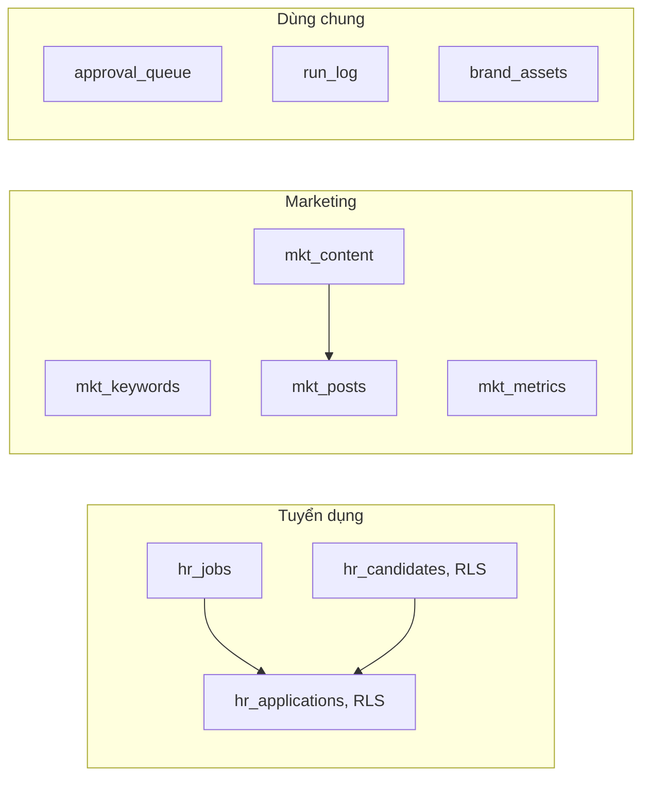

Bảng có dữ liệu cá nhân là `hr_candidates` và `hr_applications`, bật Row Level Security. Chi tiết cột ở `supabase/migrations/20260810090000_init.sql`.

### 1.6. Vòng đời một mục duyệt

Đây là cổng chung cho điều cấm 1, 2, 3. Mọi thứ gửi ra ngoài đều đi qua vòng đời này.

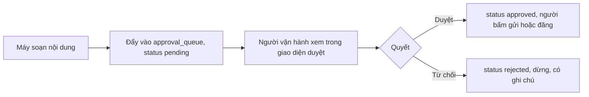

Hàm đẩy là `pushApproval` trong `packages/core/src/approval.js`. Hàm quyết là `decideApproval` cùng file, chỉ đổi được mục còn `pending` để tránh ghi đè quyết định cũ.

---

## 2. Lịch 7 ngày và trạng thái

| Ngày | Việc chính | Trạng thái | Mốc nghiệm thu |
|---|---|---|---|
| 1 | Nền chung: repo, CLAUDE.md, Supabase, `packages/core`, giao diện duyệt, một Action chạy thử | ✅ | Một tác vụ theo lịch sinh mục chờ duyệt, người bấm, trạng thái đổi |
| 2 | Bạn A: `/hr-jd` và đường nạp CV. Bạn B: kho từ khóa, `brand-voice`, `product-boundary` | 🟡 | HR đã xong. Marketing chưa |
| 3 | Bạn A: `cv-screening`. Bạn B: rà soát SEO, cỗ máy nội dung bốn bước | ⬜ | CV chấm tự động trong ngày nhận |
| 4 | Đăng tự động trên môi trường test. Ngày quan trọng nhất | ⬜ | Luồng đăng sạch 3 kênh, mỗi kênh 5 lần |
| 5 | Bạn A: câu hỏi phỏng vấn và thư mời. Bạn B: dây chuyền video | ⬜ | Thư mời chờ duyệt, video một dọc một ngang |
| 6 | Đo lường và làm cứng | ⬜ | Kéo số liệu về, dừng khẩn dưới 30 giây |
| 7 | Chuyển tài khoản thật và bàn giao | ⬜ | Một tin thật có ảnh chụp kiểm chứng |

Trạng thái chi tiết từng phần nằm ở các mục bên dưới.

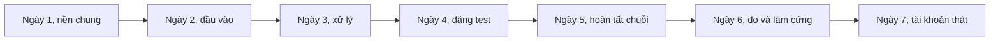

---

## 3. Nền chung: packages/core

**Trạng thái:** ✅ Đã làm. **Vị trí:** `packages/core/src/`.

**Mục tiêu:** viết một lần, cả hai mảng dùng chung. Gom mọi cổng an toàn vào một chỗ để không mảng nào tự viết đường vòng.

**Đầu vào cần cung cấp:** biến môi trường `SUPABASE_URL` và `SUPABASE_SERVICE_ROLE_KEY` trong `.env`.

**Đầu ra:** các hàm dùng chung, xuất ở `packages/core/src/index.js`.

### 3.1. Các hàm và vai trò

| Hàm | Tệp | Đầu vào | Đầu ra | Việc |
|---|---|---|---|---|
| `getEnv` | `env.js` | biến môi trường | `{ url, serviceKey }` | Đọc và kiểm khóa, thiếu thì báo lỗi rõ ràng |
| `getServiceClient` | `supabase.js` | không | client Supabase | Client khóa service role, chỉ dùng ở backend |
| `logRun` | `run-log.js` | `{ task, actor, status, detail, screenshotPath, costVnd }` | id bản ghi | Ghi nhật ký một thao tác |
| `pushApproval` | `approval.js` | `{ kind, title, payload, refTable, refId }` | id mục | Đẩy vào hàng đợi, mặc định `pending` |
| `decideApproval` | `approval.js` | id, `approved` hoặc `rejected` | id | Người quyết, chỉ đổi mục còn `pending` |
| `getCounter`, `incrementDailyCounter` | `quota.js` | `{ account, kind, day, limit }` | số đếm, cờ `allowed` | Bộ đếm hạn mức ngày, lưu trong cơ sở dữ liệu |
| `isStopped`, `assertNotStopped`, `setEmergencyStop` | `emergency-stop.js` | client | cờ dừng | Công tắc dừng khẩn, đọc từ `app_config` |
| `runBrowserFlow`, `humanType`, `randomDelay`, `BarrierError` | `browser-runner.js` | xem mục 8 | xem mục 8 | Chạy luồng trình duyệt an toàn |

### 3.2. Browser runner, cách hoạt động

`runBrowserFlow(client, { account, profileDir, task, dryRun, flow })` trong `packages/core/src/browser-runner.js` là khung chạy mọi thao tác web. Mảng hr hoặc marketing chỉ truyền hàm `flow` chứa logic nghiệp vụ, phần an toàn do runner lo.

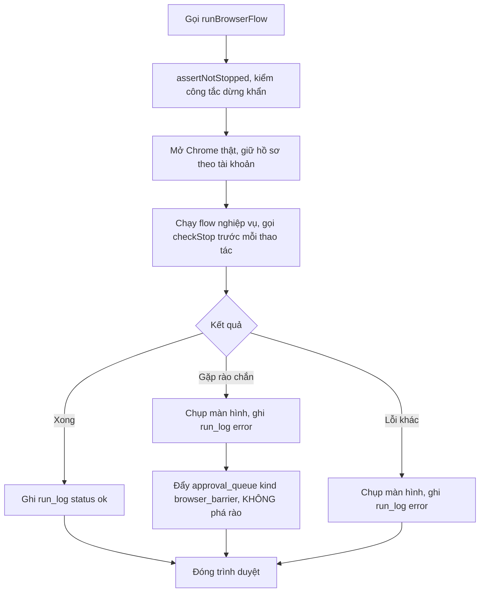

Điểm cốt lõi: khi gặp mã xác nhận hình ảnh hay xác thực hai bước, `flow` ném `BarrierError`, runner dừng và đẩy vào hàng đợi cho người xử lý bằng tay. Đây là điều cấm phá rào trong kế hoạch Phần 6. Playwright được nạp động, nên `packages/core` vẫn dùng được ở các tác vụ không cần trình duyệt.

---

## 4. Cơ sở dữ liệu và RLS

**Trạng thái:** ✅ Lược đồ đã viết. Áp dụng vào dự án Supabase do người vận hành làm. **Vị trí:** `supabase/migrations/`.

**Đầu vào cần cung cấp:** một dự án Supabase, ba khóa `SUPABASE_URL`, `SUPABASE_ANON_KEY`, `SUPABASE_SERVICE_ROLE_KEY`.

**Đầu ra:** mười bảng nghiệp vụ, hai bảng phụ trợ (`app_config`, `daily_counters`), và chính sách RLS.

**Cách áp dụng:** dán ba file trong `migrations` vào SQL Editor của Supabase theo thứ tự thời gian, hoặc dùng Supabase CLI. Chi tiết ở `supabase/README.md`.

**Mô hình phân quyền:**

- `service_role`: backend và tác vụ theo lịch, tự bỏ qua RLS.
- `authenticated`: nhân sự đăng nhập giao diện duyệt, thao tác qua chính sách.
- `anon`: khách chưa đăng nhập, không có chính sách nên không đọc được, kể cả bảng ứng viên.

---

## 5. Giao diện duyệt

**Trạng thái:** ✅ Bản tối giản đã làm. **Vị trí:** `apps/approval-ui/`.

**Mục tiêu:** nơi người vận hành thực thi điều cấm 1 và 2, xem mục chờ và bấm quyết.

**Đầu vào cần cung cấp:** `SUPABASE_URL` và khóa cho ứng dụng, đặt ở `apps/approval-ui/.env.local`.

**Đầu ra:** danh sách mục `pending`, nút Duyệt, nút Từ chối, ô ghi chú.

**Cách hoạt động:** trang đọc `approval_queue` các mục `pending`, tự làm mới 30 giây. Khi bấm, hàm `decideForm` trong `apps/approval-ui/app/actions.ts` cập nhật trạng thái, chỉ đổi mục còn `pending`, rồi làm mới trang.

---

## 6. Mảng Tuyển dụng

Phụ trách Bạn A. Nền chi tiết ở `docs/app-map/tuyen-dung.md`.

### 6.1. Luồng tuyển dụng từ đầu tới cuối

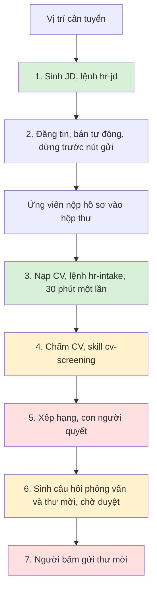

Màu xanh là phần đã làm, màu vàng là phần theo lịch ngày sau, màu đỏ là bước con người giữ quyền quyết. Bước 5 và bước 7 không bao giờ tự động, đó là điều cấm 1 và 2.

### 6.2. Lệnh /hr-jd, sinh JD bốn phiên bản

**Trạng thái:** ✅ **Vị trí:** `.claude/commands/hr-jd.md`, `packages/hr/src/jd/`.

**Mục tiêu:** soạn mô tả công việc thành bốn bản độ dài cho bốn kênh, lưu vào `hr_jobs`.

**Đầu vào:**

- Người dùng cung cấp: tên vị trí, phòng ban, nơi làm việc, mô tả, yêu cầu, quyền lợi. Thiếu thì lệnh hỏi lại, không bịa.
- Cấu hình kênh: `packages/hr/src/jd/channels.js`.

**Đầu ra:** một dòng trong `hr_jobs` với cột `jd_versions` chứa bốn kênh, và một bản ghi `run_log`.

**Bốn kênh:**

| Khóa | Kênh | Độ dài mục tiêu |
|---|---|---|
| `website` | Website tuyển dụng công ty | 400 tới 700 từ, đầy đủ |
| `job_board` | Trang tuyển dụng chuyên | 250 tới 450 từ, chuẩn |
| `facebook` | Mạng xã hội | 80 tới 160 từ, ngắn thu hút |
| `zalo_sms` | Tin nhắn Zalo hoặc SMS | 20 tới 45 từ, rất ngắn |

**Cách hoạt động:**

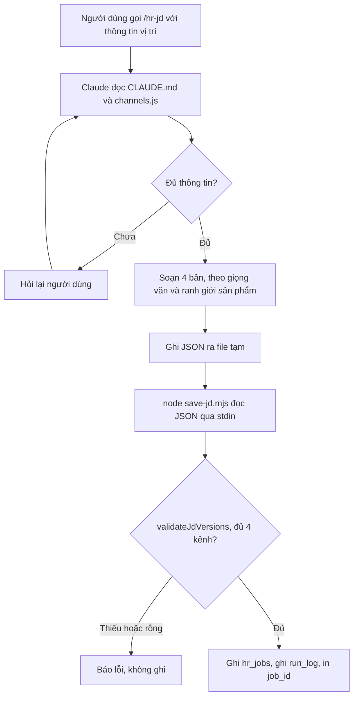

Bước sinh nội dung do Claude Code làm theo hướng dẫn trong `hr-jd.md`, có ràng buộc giọng văn (điều cấm giọng văn) và ranh giới sản phẩm (điều cấm 4 và 5). Bước lưu do `save-jd.mjs` làm, kiểm đủ bốn kênh bằng `validateJdVersions` trước khi chạm cơ sở dữ liệu. Lệnh không tự đăng tin ở đâu.

### 6.3. Đường nạp CV, lệnh /hr-intake

**Trạng thái:** ✅ **Vị trí:** `.claude/commands/hr-intake.md`, `packages/hr/src/intake/`, `.github/workflows/hr-intake.yml`.

**Mục tiêu:** đọc hộp thư nhận hồ sơ, trích văn bản, chuẩn hóa JSON, khử trùng lặp, lưu tệp và ghi bản ghi. Chạy 30 phút một lần.

**Đầu vào cần cung cấp:**

- Hộp thư IMAP: `MAIL_IMAP_HOST`, `MAIL_IMAP_PORT`, `MAIL_IMAP_USER`, `MAIL_IMAP_PASSWORD`. Giai đoạn test dùng hộp thư riêng. Với Gmail phải dùng App Password.
- Supabase: `SUPABASE_URL`, `SUPABASE_SERVICE_ROLE_KEY`.
- Tùy chọn: `CV_BUCKET` (mặc định `cv`), `HR_RETENTION_MONTHS` (mặc định 12).

**Đầu ra:**

- Dòng mới hoặc cập nhật trong `hr_candidates`, có `cv_json`, `dedup_key`, `consent_at`, `retention_until`.
- Một dòng `hr_applications` trạng thái `new`.
- Tệp CV trong Storage bucket `cv`.
- Bản ghi `run_log` cho lượt chạy.

**Cảnh báo điều cấm 6:** hộp thư cá nhân chỉ dùng chạy thử với CV giả. Trước khi CV thật của ứng viên chảy vào, phải đổi sang hộp thư do công ty kiểm soát.

**Cách hoạt động, luồng tổng:**

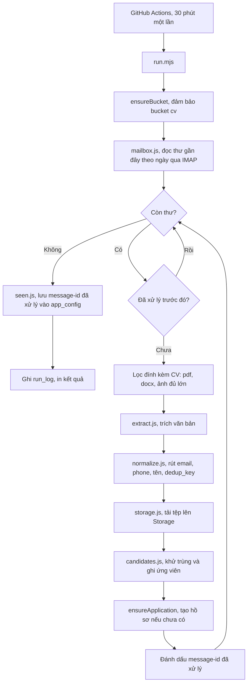

**Trích văn bản theo loại tệp**, trong `packages/hr/src/intake/extract.js`:

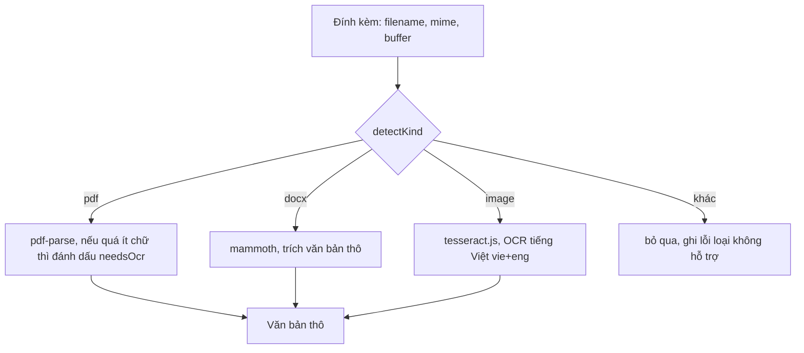

Mỗi thư có thể nhiều đính kèm, văn bản được gộp lại thành một hồ sơ. Lỗi trích một tệp không làm sập lượt chạy, lỗi được ghi theo từng tệp.

**Chuẩn hóa và khử trùng lặp**, trong `normalize.js` và `candidates.js`:

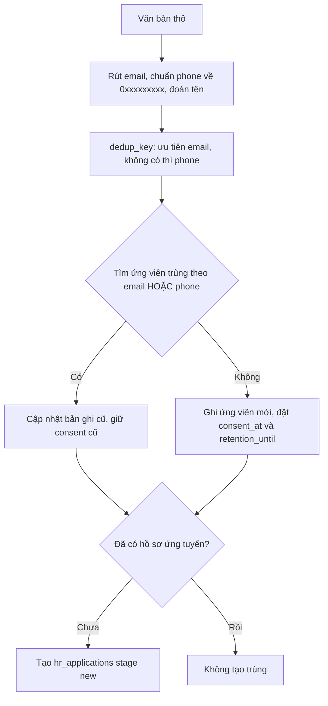

Chuẩn hóa số điện thoại Việt Nam đưa mọi dạng về `0xxxxxxxxx`, đổi tiền tố `+84` hoặc `84` thành `0`. Coi là trùng khi khớp email hoặc phone, khi đó cập nhật bản ghi cũ chứ không tạo mới, đúng yêu cầu khử trùng theo email và số điện thoại.

**Chế độ diễn tập để kiểm nhanh, không cần hộp thư và không ghi gì:**

```bash
node packages/hr/src/intake/run.mjs --dry-run --file duong/dan/cv.pdf
```

Đã kiểm với CV mẫu DOCX: trích đúng văn bản, rút đúng email, đổi `+84 912 345 678` thành `0912345678`, dựng `dedup_key` là `email:...`.

### 6.4. Chấm CV, skill cv-screening

**Trạng thái:** ⬜ Theo lịch Ngày 3.

**Mục tiêu:** chấm CV theo thang điểm cố định của từng vị trí, chống thiên vị.

**Đầu vào dự kiến:** `cv_json` của ứng viên, thang điểm của vị trí trong `hr_jobs`. Bỏ tên, giới tính, tuổi, ảnh, quê quán trước khi đưa vào chấm.

**Đầu ra dự kiến:** điểm từng trục, ba câu tóm tắt, ba điểm mạnh, ba điểm cần làm rõ khi phỏng vấn. Lưu vào `hr_applications.score_json` và các cột liên quan.

**Cổng an toàn:** thang điểm cố định, không để mô hình tự nghĩ tiêu chí. Máy xếp hạng, người quyết, không có nhánh tự loại, đó là điều cấm 2.

### 6.5. Phỏng vấn và thư mời

**Trạng thái:** ⬜ Theo lịch Ngày 5.

**Đầu vào dự kiến:** hồ sơ ứng viên đã chấm.

**Đầu ra dự kiến:** bộ câu hỏi riêng theo ứng viên (8 câu kỹ thuật bám dự án, 4 câu hành vi, 1 bài về nhà 3 giờ kèm barem), ba khung giờ đề xuất, một thư mời đẩy vào `approval_queue` trạng thái `pending`. Người bấm mới gửi, đó là điều cấm 1.

---

## 7. Mảng Marketing

Phụ trách Bạn B. Nền chi tiết ở `docs/app-map/marketing.md`. Toàn mảng hiện ⬜ chưa làm.

### 7.1. Luồng marketing từ đầu tới cuối

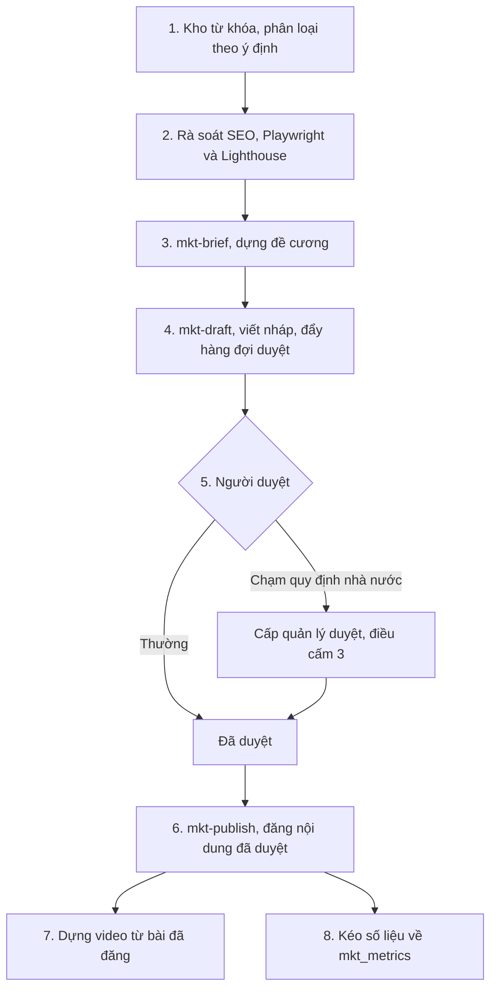

### 7.2. Kho từ khóa

**Trạng thái:** ⬜ Ngày 2. **Đầu vào:** gợi ý tìm kiếm Google, câu hỏi thật trong hộp thư và tổng đài 1900 23 23 49, từ khóa đối thủ. **Đầu ra:** tối thiểu 150 mục trong `mkt_keywords`, phân loại theo ý định, gán trang đích.

### 7.3. Skill brand-voice và product-boundary

**Trạng thái:** ⬜ Ngày 2. **Mục tiêu:** hai skill nền soát mọi nội dung sinh ra.

- `brand-voice`: kiểm và sửa theo chuẩn giọng văn ở CLAUDE.md mục 4, chặn bịa (điều cấm 5).
- `product-boundary`: chặn mô tả phần mềm đối tác như năng lực của SDVICO (điều cấm 4).

**Nghiệm thu:** kiểm trên tối thiểu 20 đoạn văn cài lỗi sẵn.

### 7.4. Rà soát SEO

**Trạng thái:** ⬜ Ngày 3. **Đầu vào:** URL trang. **Đầu ra:** danh sách lỗi xếp theo mức tác động, dùng Playwright và Lighthouse.

### 7.5. Cỗ máy nội dung bốn bước

**Trạng thái:** ⬜ Ngày 3. Ba lệnh `mkt-brief`, `mkt-draft`, `mkt-publish` cộng một bước người duyệt.

**Đầu vào và đầu ra từng lệnh:**

| Lệnh | Đầu vào | Đầu ra |
|---|---|---|
| `mkt-brief` | từ khóa, trang đích | đề cương nội dung |
| `mkt-draft` | đề cương | bản nháp trong `mkt_content` trạng thái review, đẩy `approval_queue`, đặt `needs_gov_review` khi chạm quy định |
| `mkt-publish` | nội dung đã duyệt | bài trong `mkt_posts`, đăng qua API chính thức trước |

### 7.6. Dây chuyền video

**Trạng thái:** ⬜ Ngày 5. **Đầu vào:** bài đã đăng, tư liệu trong `brand_assets` (chỉ `owned` hoặc `licensed`). **Đầu ra:** bản dọc 60 giây và bản ngang 3 tới 5 phút, phụ đề bằng Whisper, ba tiêu đề, ba ảnh đại diện. Dùng ffmpeg và Whisper trên máy nội bộ.

---

## 8. Đăng tự động bằng Playwright

**Trạng thái:** browser runner ✅ đã có. Các luồng đăng cụ thể ⬜ theo lịch Ngày 4.

**Mục tiêu:** tự động thao tác web khi không có API, trong khối lượng một nhân viên làm tay cũng làm được, không phá rào nền tảng.

**Thứ tự ưu tiên bắt buộc:** có API chính thức thì dùng API. Không có mới dùng trình duyệt. Không dùng trình duyệt để lách giới hạn API đã đặt.

**Bốn mức thử nghiệm** (kế hoạch Phần 5):

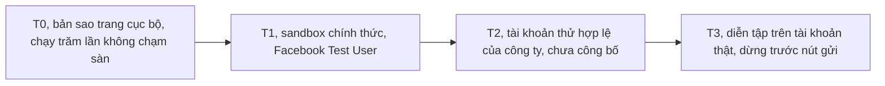

**Đầu vào cần cung cấp:** máy chủ nội bộ có màn hình ảo, địa chỉ mạng cố định, Chrome thật, hồ sơ trình duyệt theo tài khoản.

**Bảy nguyên lý tránh bị chặn** (kế hoạch Phần 6.2), đã cài trong runner: đăng nhập càng ít càng tốt và giữ hồ sơ, dùng Chrome thật, một địa chỉ mạng ổn định, nhịp độ của người, hạn mức tự đặt thấp hơn sàn, chờ theo trạng thái, gặp rào là dừng.

**Sáu điều kiện chuyển từ test sang thật** (kế hoạch Phần 5.4), do người review chéo ký xác nhận:

1. Chạy sạch 20 lần liên tiếp ở T0.
2. Chạy sạch 5 lần ở T1 hoặc T2.
3. Trần hạn mức ngày đã cài và đã kiểm bằng cách cố vượt.
4. Công tắc dừng khẩn tắt được tác vụ trong dưới 30 giây.
5. Mọi nhánh lỗi dừng và đẩy hàng đợi, không nhánh nào thử lại quá 3 lần.
6. Có người vận hành ngồi cạnh lần chạy thật đầu tiên.

---

## 9. Đo lường và làm cứng

**Trạng thái:** ⬜ Ngày 6. Một phần đã có sẵn trong `packages/core`.

**Đo lường:** kéo số liệu Google Search Console, Analytics, Facebook Insights, YouTube về `mkt_metrics`. Dashboard tuyển dụng: số ứng viên theo nguồn, tỷ lệ chuyển đổi từng bước, thời gian mỗi bước.

**Làm cứng:**

| Việc | Đã có | Ghi chú |
|---|---|---|
| Thử lại có giãn cách khi lỗi | 🟡 | `randomDelay` có, chính sách thử lại tối đa 3 lần cần chuẩn hóa |
| Công tắc dừng khẩn | ✅ | `emergency-stop.js`, đọc từ `app_config` |
| Bộ đếm hạn mức trong cơ sở dữ liệu | ✅ | `quota.js`, bảng `daily_counters` |
| Cảnh báo chi phí mô hình chạm 80 phần trăm | ⬜ | Trần tham chiếu 3.000.000 đồng, biến `MODEL_BUDGET_VND` |
| Ghi log đầy đủ kèm ảnh chụp khi lỗi | ✅ | `run_log`, browser runner tự chụp |

---

## 10. Chuyển sang tài khoản thật và bàn giao

**Trạng thái:** ⬜ Ngày 7.

**Điều kiện:** mọi luồng đã chạy sạch trên môi trường test, sáu điều kiện ở mục 8 được ký xác nhận.

**Sáng:** đổi cấu hình sang tài khoản thật, chạy diễn tập một vòng đầy đủ, người vận hành xem ảnh chụp từng bước rồi mới mở khóa. Chạy thật hạn mức tối thiểu: một tin tuyển dụng, một bài website, một bài Facebook, một video không công khai. Theo dõi 2 giờ.

**Chiều:** demo 30 phút, bàn giao mã nguồn, tài liệu vận hành, danh sách việc còn nợ.

---

## 11. Cần cung cấp: biến môi trường và tài khoản

Danh sách đầy đủ ở `docs/can-cung-cap.md`. Tóm tắt biến môi trường:

| Biến | Dùng cho | Bắt buộc |
|---|---|---|
| `SUPABASE_URL` | Kết nối cơ sở dữ liệu | Có |
| `SUPABASE_ANON_KEY` | Giao diện duyệt | Có |
| `SUPABASE_SERVICE_ROLE_KEY` | Backend và tác vụ theo lịch | Có |
| `ANTHROPIC_API_KEY` | Claude Code headless | Có |
| `MAIL_IMAP_HOST`, `MAIL_IMAP_PORT`, `MAIL_IMAP_USER`, `MAIL_IMAP_PASSWORD` | Nạp CV | Có, cho hr-intake |
| `MAIL_IMAP_MAILBOX`, `CV_MIN_IMAGE_BYTES` | Tinh chỉnh nạp CV | Không |
| `CV_BUCKET`, `HR_RETENTION_MONTHS` | Storage và thời hạn lưu | Không, có mặc định |
| `FACEBOOK_APP_ID`, `FACEBOOK_APP_SECRET`, `FACEBOOK_PAGE_ID`, `FACEBOOK_PAGE_ACCESS_TOKEN` | Đăng Facebook | Có, cho marketing |
| `GOOGLE_CLIENT_ID`, `GOOGLE_CLIENT_SECRET` | Search Console, Analytics | Có, cho đo lường |
| `MODEL_BUDGET_VND` | Trần chi phí mô hình | Không, mặc định 3.000.000 |

**Nguyên tắc bí mật:** mọi khóa đặt trong `.env` cục bộ hoặc GitHub Secrets. Không dán vào chat, không commit vào Git. Mật khẩu và xác thực hai bước do người vận hành giữ, không giao cho người viết code. Đó là điều cấm 7.

---

## 12. Cách chạy nhanh

Cài phụ thuộc một lần ở gốc repo:

```bash
npm install
```

Diễn tập nạp CV trên một tệp cục bộ, không cần hộp thư:

```bash
node packages/hr/src/intake/run.mjs --dry-run --file duong/dan/cv.pdf
```

Chạy nạp CV thật, cần `.env` đủ hộp thư và Supabase:

```bash
node packages/hr/src/intake/run.mjs
```

Lưu JD sau khi đã sinh nội dung, đọc JSON qua đường ống:

```bash
node packages/hr/src/jd/save-jd.mjs < jd.json
```

Chạy giao diện duyệt ở máy phát triển:

```bash
npm run ui:dev
```

Tác vụ theo lịch: `.github/workflows/hr-intake.yml` chạy 30 phút một lần, `.github/workflows/daily-demo.yml` chạy mốc demo. Cả hai đọc khóa từ GitHub Secrets.
